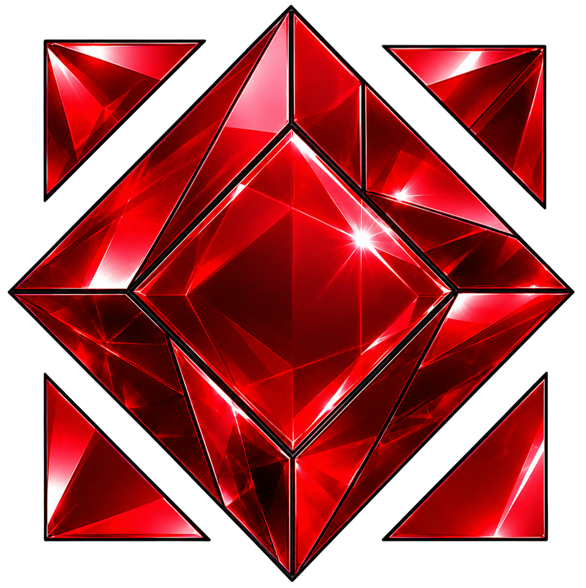

<div align="center">
  

  # THE GEM — Landing Page

  > Landing page del proyecto integrador del módulo 1 — Soy Henry Full Stack 3.0

</div>

---

## 📄 ¿Qué es este proyecto?

Landing page presentación del videojuego **THE GEM**, desarrollada como proyecto integrador del Módulo 1 del bootcamp Full Stack de Soy Henry.

Construida con **HTML5, CSS3 y JavaScript vanilla** — sin frameworks, sin librerías externas. Toda la interactividad fue implementada a mano.

---

## 🗂️ Secciones de la página

| Sección | Descripción |
|---|---|
| **Hero** | Presentación del juego con imagen del personaje y stack tecnológico |
| **Características** | Cards con las funcionalidades principales del juego |
| **Sobre mí** | Perfil del creador y links del proyecto |
| **Demo jugable** | Mini juego interactivo embebido directamente en la página |
| **GEM Color Studio** | Herramienta generadora de paletas de colores al estilo THE GEM |
| **Contacto / Footer** | Links de redes y datos de contacto |

---

## 🎮 Demo jugable

La página incluye un mini juego jugable embebido, construido con **HTML5 Canvas y JavaScript puro**.

- Controlás una bolita cyan esquivando círculos rojos
- Compatible con **mouse** (escritorio) y **touch** (móvil)
- Dificultad progresiva: los obstáculos aumentan de velocidad con el puntaje
- Sistema de Game Over con puntaje final

<div align="center">
  
</div>

---

## 🎨 GEM Color Studio

Herramienta interactiva que genera paletas de colores al estilo visual de THE GEM.

- Paletas de **6, 8 o 9 colores** generados aleatoriamente en rangos HSL
- Visualización en formato **HSL o HEX**
- **Clic en cualquier color** para copiar su HEX al portapapeles
- Toast de microfeedback al generar o copiar
- Animación de entrada en las tarjetas
- Regeneración automática al cambiar tamaño o formato

<div align="center">
  
</div>

---

## 🛠️ Tecnologías utilizadas

- **HTML5** — estructura semántica con `<article>`, `<section>`, `<aside>`, `<nav>`
- **CSS3** — diseño responsive con variables CSS, grid y flexbox
- **JavaScript ES6** — lógica del mini juego, generador de paletas y dinámica del DOM
- **HTML5 Canvas** — renderizado del mini juego
- **Netlify** — deploy del sitio

---

## 🗂️ Estructura del proyecto

```
the-gem-landing/
├── index.html          # Estructura principal de la página
├── css/
│   └── styles.css      # Estilos y variables CSS
├── js/
│   ├── app.js          # Inicialización y año del footer
│   ├── minijuego.js    # Lógica del mini juego (Canvas)
│   └── paleta.js       # Generador de paletas (GEM Color Studio)
└── img/
    ├── Logo_THE_GEM.png
    ├── pelota.png
    ├── Cap_1.png
    └── Cap_2.png
```

---

## 🚀 Cómo ejecutarlo localmente

```bash
# 1. Clona el repositorio
git clone https://github.com/tu-usuario/the-gem-landing.git

# 2. Entra a la carpeta
cd the-gem-landing

# 3. Abre index.html en tu navegador
#    (o usá Live Server en VS Code)
```

> No requiere instalación de dependencias. Es HTML/CSS/JS puro.

---

## 🤖 Proceso de desarrollo con IA

Durante el desarrollo usé IA (Claude) como herramienta de aprendizaje y apoyo técnico, no como reemplazo del proceso:

- **Generación de funciones:** Le mostraba capturas de la interfaz o describía el comportamiento esperado, y la IA me ayudaba a implementar la función (por ejemplo, la lógica del generador de paletas HSL y la conversión a HEX).
- **Explicación línea por línea:** Cuando no entendía una parte del código, pegaba la línea o el bloque y pedía que me lo explicara en detalle antes de seguir.
- **Revisión y corrección:** Usé capturas del comportamiento visual para detectar bugs y discutir soluciones.
- **Todo el código fue revisado y comprendido** antes de integrarlo al proyecto.

> El objetivo fue usar la IA como haría con un senior developer: consultando, preguntando el porqué, y tomando las decisiones finales yo mismo.

---

## 👤 Autor

**Felipe León Mahecha**
Estudiante Full Stack — Soy Henry Bootcamp 3.0
📍 Paipa, Boyacá, Colombia

---

## 📄 Estado del proyecto

✅ **Entregado** — Proyecto integrador Módulo 1, Soy Henry Full Stack 3.0
